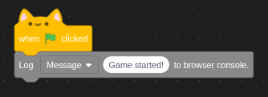

# The Debugging tools extension.

The primary goal of this extension is to add extra tools for debugging projects, it adds various things such as acces to the console, this extension has also been used to debug the extension builder, because of that the source code inside of turbowarp is also availalbe.

## logging, warning and erros to the console.

Logging messages to the browsers console is very easy, jsut drag a log [type] [message] block into the work space and select which kind of message you want to log to the browsers console.
