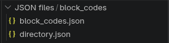
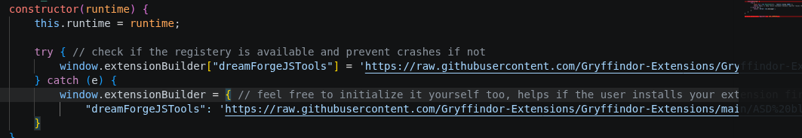

# blocks

### defining the block or argument type

Block/Argument types are no longer defined using Scratch.blockType or Scratch.argumentType but instead are now jsut a upper case string of the type you want e.g. "HAT" or "STRING"

# block_codes

## The directory.json file

The directory.json file tells the compiler where the code for each opcode is located, the key is the file name and the value is an array with al lthe opcodes inside of that file.

## defining the opcode

You can define the opcode in a json file by simply putting the Opcode in it, the compiler then grabs the opcode associated with a block and finds the correct opcode in the json file.

### opcode name

{
    "getArgumentValue": { <--- the name of the opcode
        "singleline": true,
        "code": [
            "args.",
            "NAME"
        ]
    }
}

### argument values

The extension builder compiler builds your code from a simple array, in this array you have to explicity tell it where to place the values of the arguments, you do this by making a seperate list item with the name of the argument.

{
    "getArgumentValue": {
        "singleline": true,
        "code": [
            "args.",
            "[NAME]" <--- Argument name with brackets to tell the system its an argument, only call it [TRANSPILE] if you want to tell the compiler to transpile the next blocks.
        ]
    }
}

### Argument names

By default all argument names can follow any typing convention you want, however there are several conventions you can follow if you want the compiler to do a certain thing with the argument value.
These conventions must be in the argument name and cannot be defined anywhere else.

| Name       | Description |
| ---------------| -------- |
| RAW_             | If your argument name starts with RAW_<argumentname> then the compiler will return the output as a raw unmodifed object, it isnt stringified or turned into a number. |

### compiling singleLine code

Due to readability issues the compiler can sometimes make single line code become multi line code or vice versa, to solve this you can use the singleLine property in the json to explicity tell the compiler to compile the current batch as a single line, by default this is false (multiline), if its set to false the compiler automatically appends a newline at the end of each line of code to create a more readable code structure.

{
    "getArgumentValue": {
        "singleLine": true, <--- Tells the compiler to make the code into a singleLine, defaults to false (multiline code)
        "code": [
            "args.",
            "NAME"
        ]
    }
}

### compiling with dependencies

By default a extension is compiled with no dependencies, however it may turn out that your block has depenencies, it for example needs to have access to the runtime object of scratch.
If your block has dependencies you can pass on a depencies key with an array with the name of your depenencies as described bellow.

    "checkFunctionAvailability": {
        "singleLine": true,
        "dependencies" :["runtime"], <--- tells the compiler the block needs to access the runtime object
        "code": [
            "!String(this.runtime.getOpcodeFunction('",
            "[NAME]",
            "')) === 'undefined'\n"
        ]
    },

| Name       | Description |
| ---------------| -------- |
| runtime             | Tells the compiler the block needs access to the runtime object of scratch. |

# extension support

Are you a extension developer and you want to bring support for the extension builder and your extension? Then this section is for you!

## file structure

By default all code for the blocks is placed inside of the JSON files folder then inside of that folder is another folder placed called block_codes, inside this folder you place a directory.json file (used by the compiler to find where the code is located) and a file with the json structure for the compiler to read.

To understand the structure of these files please refer to the documentation above.

Eventually you should have something like this as your file structure: 

## telling the compiler the location of your file

The compiler doesnt automatically know where you're json files are located; the compiler will only be able if you provide the url to your json files, you can do so by writting to the global extensionBuilder registery, then you can create a new key value pair with the id of your extension(key) and link to your extension (value).

This registery is only available if the extension has been installed else it'll crash, so be sure to wrap it in a extra check because extensions wont load if it crashes because the registery is not available.

example url: <https://raw.githubusercontent.com/dreamForge-forging-our-dreams-in-tech/Gryffindor-Extensions/refs/heads/main/ASD%20blocks/>

