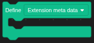
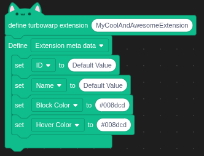
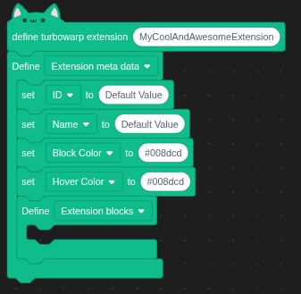
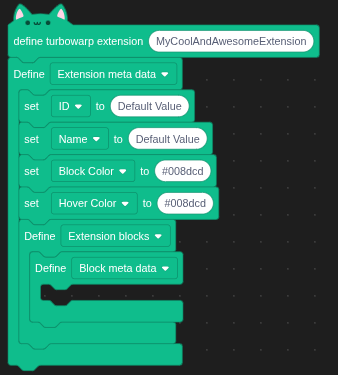
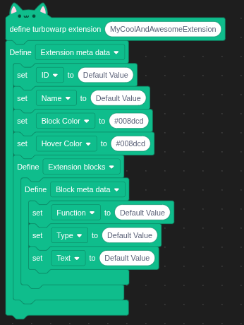
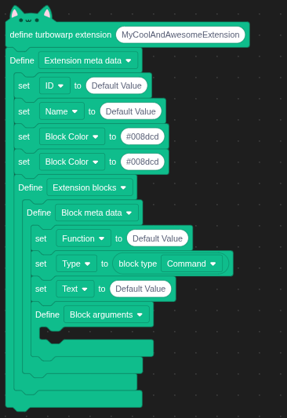
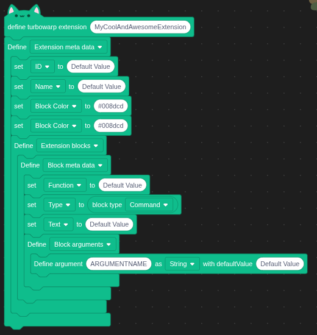
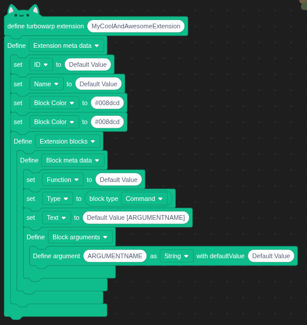
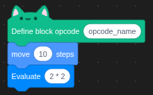

# extension builder blocks

# requirements
Must run unsandboxed!
If not ran unsandboxed the extension wont be able to render or compile your extension correctly.

Must have some understanding of turbowarp [extensions](https://docs.turbowarp.org/development/extensions/introduction)

# defining a extension class
To define a extension you drag the define turbowarp extension into the workspace and enter the class name for the extension.

# defining extension meta data
The define extension meta data is a block where you can drag in any meta data block, the block then compiles those into a json object that turbowarp reads to build the extension.

| Name       | Description |
| ---------------| -------- |
| ID             | A unique ID used only by this extension. Multiple extensions cannot share the same ID. Can only use the letters a-z and 0-9 -- no spaces or special characters.   |
| Name           | The name of the extension that appears in the toolbox. If not provided, it will default to the extension id.   |
| Block Color    | The color of the block provided as a HEX color (e.g. #008dcd)   |
| Hover Color    |The color of the block when the user hovers over it, provided as a HEX color (e.g. #008dcd)   |

# defining custom blocks
Defining custom blocks is just as simple as defining the meta data.

First drag a "Define extension meta data" block into the "define extension meta data" block and change its dropdown menu to "Extension blocks"

Then into this block you drag another "Define extension meta data" block and change the dropdown selection to "Block meta data", basically this is what defines each new block.

Then you can drag a meta tag block into the "define block meta data" block

Repeat step 2 and 3 to create multiple blocks

| Name       | Description |
| ---------------| -------- |
| Function             | The name of the function that will execute when this block is called |
| Type           | The kind of type you want the block to be.   |
| Text    | The text that appears on the block, follows the same strucutre as the scratchblocks tool does. |
| Branch Count (number)   | Adds branches to the block, a branch is the c shaped part of a block where you can put other blocks into, its often called a substack |

## setting block types
You can set the type of the block using to block type reporter block.

## defining block arguments

Defining block arguments, is a bit more advanced but follows the same structure as usual.

Drag in a "define extension meta data block" into the "define block meta data" block, switch its dropdown value to "Define block arguments".

Then into the "define block arguments" block you can drag a "Define argument" block, type the argument name(must be UPPERCASE and unique), argument type and the default value of the argument.

| Name       | Description |
| ---------------| -------- |
| String             | The argument will only accept text as its input |
| Number           |The argument will only accept numeric inputs |
| Boolean    | The argument will only accept boolean arguments (true/false) |

now that you have defined your arguments for the block you can tell turbowarp where to display them.
You do this by using [ARGUMENTNAME] in the blocks "text" definition, you can type this anywhere and as many times in your block.

## defining the blocks opcode code
Custom blocks always need to know what to do, custom javascript functions are connected to them via the set opcode in the blocks meta tag field, however you still need to define this opcode, to do so you can use the "Define block opcode" hat.
Just enter the corresponding opcode name and attach any block you like to give it a functionality.
You can use all the build in blocks and any installed extension (aslong as the user also installs them!)

### accesing argument values in the opcode hat
You can acces the value a user has entered into the arguments with the "get value of argument [NAME]" block.

# generating and viewing extension code
During the development of your extension you can preview a live view of the code, any change you make is updated and you can manually update the code view by clicking the "Display generated code"

# FAQ

## my blocks are still not appearing
* Have you checked whether the name provided in the block meta tags Function value actually exists? IF it doesnt exist turbowarp will not render your block!