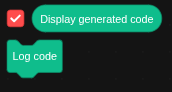

# extension builder blocks

# requirements
Must run unsandboxed!
If not ran unsandboxed the extension wont be able to render or compile your extension correctly.

# defining a extension class
To define a extension you drag the define turbowarp extension into the workspace and enter the class name for the extension.

# defining extension meta data
The define extension meta data is a block where you can drag in any meta data block, the block then compiles those into a json object that turbowarp reads to build the extension.

# generating extension code

To generate the code for the extension you can press the Log code block in the toolbox, dont drag it into the workspace but click it.
This then logs the generated code to the console and updates the "Display generated code" Variable (in case you want to view the code together with the live block preview.)

Note: this is a temporary way to acces the code, im working on changes to how this works but right now i just want to test everything before going into more "advanced" directions.