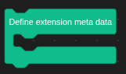
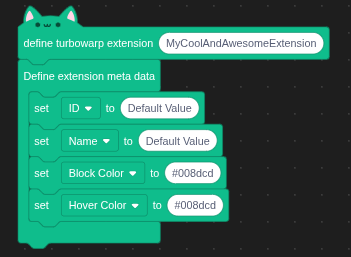
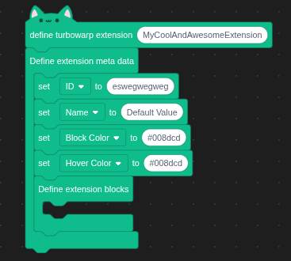
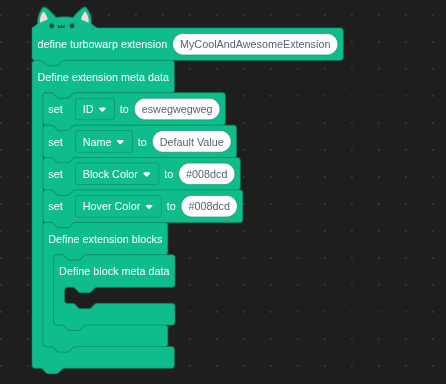
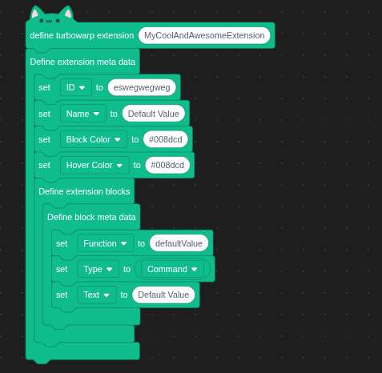
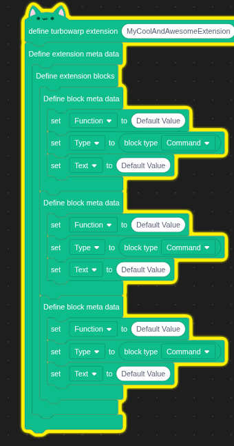

# extension builder blocks

# requirements
Must run unsandboxed!
If not ran unsandboxed the extension wont be able to render or compile your extension correctly.

Must have some understanding of turbowarp [extensions](https://docs.turbowarp.org/development/extensions/introduction)

# defining a extension class
To define a extension you drag the define turbowarp extension into the workspace and enter the class name for the extension.

# defining extension meta data
The define extension meta data is a block where you can drag in any meta data block, the block then compiles those into a json object that turbowarp reads to build the extension.

| Name       | Description |
| ---------------| -------- |
| ID             | A unique ID used only by this extension. Multiple extensions cannot share the same ID. Can only use the letters a-z and 0-9 -- no spaces or special characters.   |
| Name           | The name of the extension that appears in the toolbox. If not provided, it will default to the extension id.   |
| Block Color    | The color of the block provided as a HEX color (e.g. #008dcd)   |
| Hover Color    |The color of the block when the user hovers over it, provided as a HEX color (e.g. #008dcd)   |

# defining custom blocks
Defining custom blocks is just as simple as defining the meta data.

First drag a "Define extension blocks" block into the "define extension meta data" block

Then into this block you can drag the "define block meta data" block, basically this is what defines each new block.

Then you can drag a meta tag block into the "defineblock meta data" block

| Name       | Description |
| ---------------| -------- |
| Function             | The name of the function that will execute when this block is called |
| Type           | The kind of type you want the block to be.   |
| Text    | The text that appears on the block, follows the same strucutre as the scratchblocks tool does. |

## setting block types
You can set the type of the block using to block type reporter block.

## defining multiple blocks
Each "define block meta data" block defines a new block, so you can just simple add new ones of those to create new blocks.

# generating and viewing extension code
During the development of your extension you can preview a live view of the code, any change you make is updated and you can manually update the code view by clicking the "Display generated code"

# FAQ

## my blocks are still not appearing
* Have you checked whether the name provided in the block meta tags Function value actually exists? IF it doesnt exist turbowarp will not render your block!